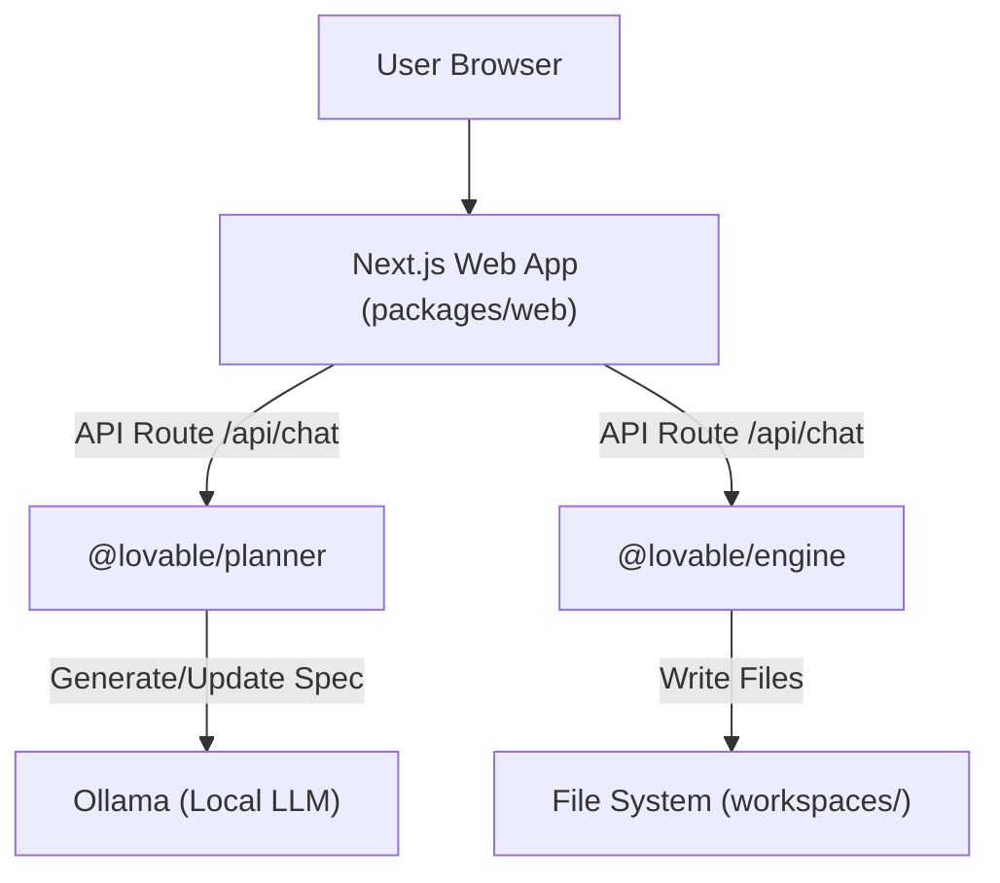

# Phase 4: Local Web UI (The "Lovable" Experience)

## Objective
Create a local web interface (`packages/web`) that mirrors the Lovable experience: a chat interface where users can create and iterate on projects using natural language.

## Architecture

## Features

1.  **Project Dashboard**: List existing projects in the workspace.
2.  **Chat Interface**:
    *   Chat bubbles history.
    *   Streamed responses (simulated or real).
    *   "Thinking" states.
3.  **Project Context**:
    *   The UI tracks which project is currently active.
    *   Sends `currentSpec` to Planner for iterative edits.
4.  **Backend Integration**:
    *   Reuses `planner` and `engine` packages directly.

## Step-by-Step Implementation

### 1. Scaffolding (`packages/webapp`)
- [x] Initialize a new Next.js app in `packages/webapp`.
- [x] Configure Tailwind CSS.
- [x] Add workspace dependencies (`@lovable/planner`, `@lovable/engine`).

### 2. Backend Logic (API Routes)
- [x] **GET /api/projects**: List directories in the `workspaces/` folder (or root).
- [x] **POST /api/create**: Accepted prompt -> Generate Spec -> Compile -> Return success.
- [x] **POST /api/edit**: Accept prompt + project ID -> Load Spec -> Update Spec -> Compile -> Return success.

### 3. Frontend UI
- [x] **Home Page**: List projects + "New Project" button.
- [x] **Project View**:
    - Split screen: Chat on left (or right), file list/status on other side.
    - (Stretch) Live preview (requires running dev server for generated app).

### 4. Integration
- [x] Connect Chat UI to API.
- [x] Handle "Thinking" states and errors (Ollama offline).

## Technical Notes

- **Port**: Web app runs on port `3000` (default).
- **Workspaces**: Generated projects will be saved in a sibling directory, e.g., `projects/` at the root of the repo, to keep them organized.
